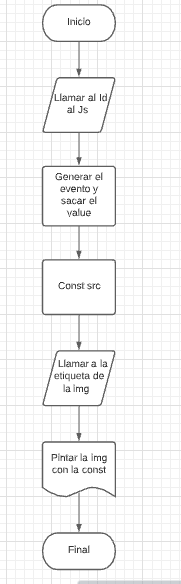

# Pseudocódigo de la primer sección, URL de la imagen.

## Como logramos que al poner la url en el input se pinte nuestra imagen en la sección correspondiente

  Inicio
  - Tener identificado de donde sacaremos el link (Llamar al id)
  -  Identificar cuando el usuario ingrese el link
  -  Guardar el link que ingreso el usuario
  -  Identificar la etiqueta o el lugar donde lo pondremos
  - Agregarle el link que el usuario ingrese para que se refleje la imagen

Fin

